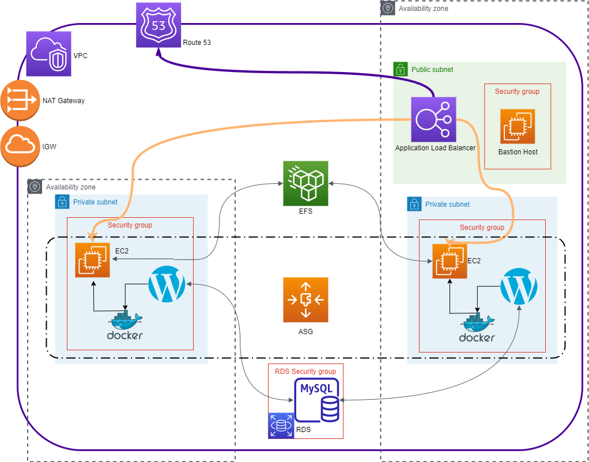

# **Projeto WordPress escalável e de alta disponibilidade com Docker e AWS - Compass.UOL**

## **Objetivo** <br>
O presente projeto, tem como objetivo ser um exercício prático de implementação de uma plataforma WordPress que foi pensada para ser altalmente escalável e de alta disponibilidade, provisionada sob a infraestrutura da AWS com uso de Docker.

Para fins de organização, foi disponibilizado na [Wiki](https://github.com/tomiokadasilva/projeto_compass_Docker_Wordpress/wiki) deste repositório o passo-a-passo para realizar cada configuração via AWS CLI. 
<br><br>
## **Arquitetura** <br>

A arquitetura da plataforma é estabelecida sobre uma VPC na AWS onde permitirá a comunicação via rede de todos componentes de forma segura e restrita. Esta VPC é disponibilizada em várias Availability Zones, permitindo um nível de disponibilidade maior da aplicação. Nela também há subnets públicas e privadas, que implementarão mais um nível de segurança com o emprego de um Bastion Host na subnet pública comunicando as instâncias que sustentam o sistema WordPress nas subnets privadas.

### **VPC**
Para a comunicação exterior à [VPC](https://github.com/tomiokadasilva/projeto_compass_Docker_Wordpress/wiki/Virtual-Private-Cloud-(VPC)), é usado um Internet Gateway que dá acesso à rede ao Bastion Host, que uma vez acessando as instâncias privadas, tem acesso à internet para download de pacotes de forma segura através do NAT Gateway (este, apesar de conceder acesso às subnets privadas, está conectado à uma subnet pública).

Toda estrutura é protegida por firewalls, neste caso, usamos os Security Groups, porém poderíamos também fazer uso de Networks ACLs para acrescentar maior segurança. As instâncias que suportam o Wordress (instâncias privadas) se encontram em subnets privadas e com isto também em Security Groups isolados pois o Bastion Host possui um Security Group exclusivo que permite o acesso à rede externa.

### **EFS**
As instâncias privadas se conectam à um volume [Elastic File System (EFS)](https://github.com/tomiokadasilva/projeto_compass_Docker_Wordpress/wiki/Elastic-File-System-(EFS)) para armazenamento dados estáticos do WordPress, importante notar que todas instâncias se conectam, neste caso, à um único volume EFS.

### **RDS**
Para persistência dos dados gerais do WordPress é usado uma instância MySQL no [Relational Database Service (RDS)](https://github.com/tomiokadasilva/projeto_compass_Docker_Wordpress/wiki/Amazon-Web-Services-Relational-Database-Service-(RDS)), por questões de segurança este RDS possui um Security Group exclusivo, onde é liberado acesso somente aos Security Groups privados, por consequência, acesso apenas às instâncias privadas.

### **ALB**
Por uma questão de disponibilidade, empregamos um [Application Load Balancer](https://github.com/tomiokadasilva/projeto_compass_Docker_Wordpress/wiki/Application-Load-Balancer-(ALB)) que distribui as requisições à todas instâncias privadas. Um ponto interessante é que o Application Load Balancer distribui as requisições para instâncias que estão em Subnets privadas, porém ele está ligado à Subnet pública para ser disponibilizado para a internet através do Internet Gateway. O Application Load Balancer também está ligado ao Route 53 para disponibilização de DNS.

### **ASG**
Toda estrutura de escalabilidade das instâncias privadas estão sob gerencia do Auto Scaling Group que aumenta e diminui a quantidade de instâncias privadas de acordo com a necessidade. O [Auto Scaling Group](https://github.com/tomiokadasilva/projeto_compass_Docker_Wordpress/wiki/Auto-Scaling-Groups-(ASG)) se comunica com o Application Load Balancer para que o roteamento de requisições se adapte à quantidade de instâncias privadas operando em cada momento. <br><br>


## **Diagrama da Arquitetura AWS**<br>


<br><br>
## **Instalação**

Neste projeto a arquitetura foi implantada usando instâncias t3.small com sistema operacional Amazon Linux 2. É possível implementar a arquitetura manual através do console AWS, também com uso de Terraform ou Cloudformation, como também por automatização de shell script com acesso à AWS CLI.

### **Shell Script**

No diretório **_provision_** há os arquivos shell contendo a execução dos passos para criação via CLI, o arquivo inicial é o `provision_all.sh`.

Para dúvidas sobre os comando AWS CLI nos scripts e suas funções, na área de Wiki deste repositório há uma explicação com exemplo sobre os comandos.

Na raíz do repositório há um exemplo de um script simples (`user-data.sh`) para ser passado como argumento na função de user-data na criação das instâncias privadas.

---

### **Cloud Formation**

Também é possível fazer o provisionamento da aplicação via CloudFormation, que é a solução de infraestrutura como código (IaC) da AWS. Dividimos a implantação em três _stacks_ para ficar mais fácil de gerenciar e de reutilizar os templates: **_network_**, **_data_** e **_app_**. Eles devem ser executados em sequência - há dependência entre eles - fornecendo os parâmetros detalhados a seguir:

#### **1. Network**

Cria toda a infraestutura de rede conforme detalhado no diagrama acima.

Parâmetros

> - **AvailabilityZones**: duas AZs onde serão criadas as subnets públicas e privadas
> - **SecurityGroupIngressCIDR**: endereço /32 o qual terá acesso SSH ao bastion host
> - **ApplicationPort**: porta na qual a aplicação responderá

#### **2. Data**

Cria os serviços requeridos para o armazenamento de dados da aplicação, nomeadamente um sistema de arquivos EFS e um banco de dados gerenciado MySQL RDS, e armazena os parâmetros de acesso a esses serviços no SSM Parameter Store.

Parâmetros

> - **NetworkStackName**: nome dado à _stack_ de _network_
> - **RDSInstanceSize**: tamanho da instância RDS (valores aceitos são "db.t2.micro" e "db.t3.micro")
> - **RDSEngineVersion**: versão da engine do MySQL (valores aceitos são "5.7.41" e "8.0.32")
> - **ApplicationDBName**: nome do banco de dados da aplicação
> - **ApplicationDBUser**: nome do usuário para acesso ao banco de dados
> - **ApplicationDBPassword**: senha segura para acesso ao banco de dados

#### **3. App**

Cria toda a infraestutura de disponibilização da aplicação, como instâncias de servidores, balanceador de carga e _Auto Scaling Group_.

Parâmetros

> - **NetworkStackName**: nome dado à _stack_ de _network_
> - **DataStackName**: nome dado à _stack_ de _data_
> - **SSHKey**: o nome de uma chave SSH previamente criada para acesso ao Bastion host e servidores de aplicação
> - **InstanceSize**: tamanho da instância dos servidores (valores aceitos são "t2.micro" e "t3.small")
---

Para facilitar a implantação dessas três _stacks_ de uma só vez, disponibilizamos um script (`create-stacks.sh`) que as executa de uma só vez na ordem correta e emita como saída o **DNS do Load Balancer** e o **IP público** do Bastion Host.

Para deletar as _stacks_, basta executar o script `delete-stacks.sh` passando como parâmetro os nomes das stacks na ordem **inversa** em que foram criados. Por exemplo,
```shell
./delete-stacks.sh wptask-app wptask-data wptask-network
```